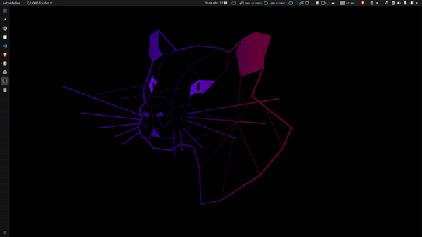

# Cpu monitor

Monitor of CPU temperature for Ubuntu menu bar



## Installation

```bash
sudo apt install lm-sensors
```

Select YES to all questions

```bash
sudo sensors-detect
```

Install psensor

```bash
sudo apt install psensor
```

## Add to startup

```bash
cpu_monitor.sh
```